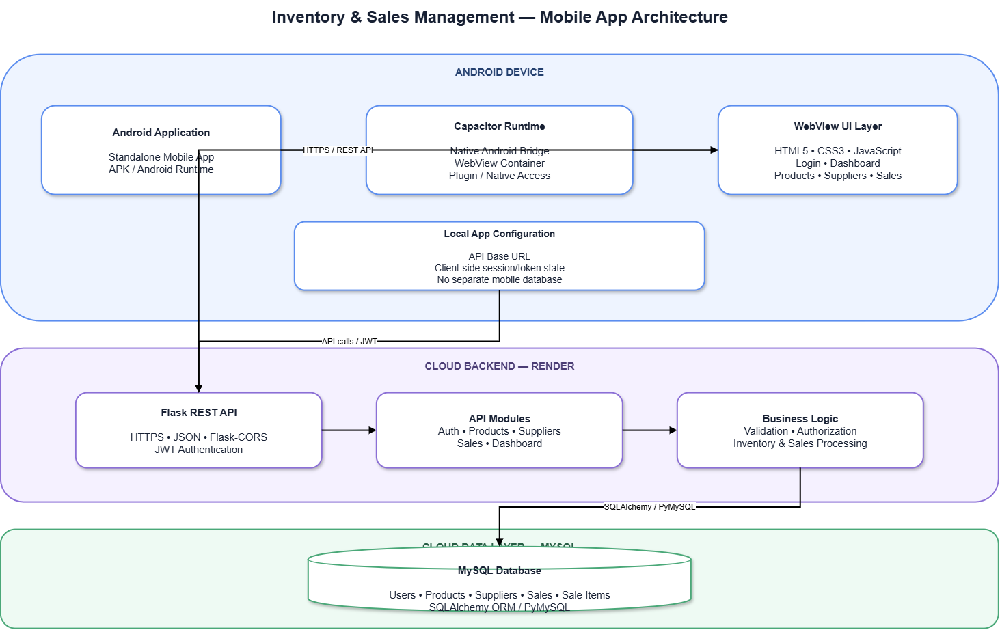

# Cloud-Based Inventory & Sales Management System

<p align="center">
  <strong>A full-stack inventory and sales management platform for small businesses</strong>
</p>

<p align="center">
  Web Application • Android Mobile Application • REST API • Cloud Database
</p>

<p align="center">
  <a href="https://inventorymgtsys.netlify.app/">Live Web Application</a>
  •
  <a href="https://github.com/jiyamaheshwari31-ctrl/inventory-management-system">GitHub Repository</a>
</p>

---

## 📌 Overview

The **Cloud-Based Inventory & Sales Management System** is a full-stack software solution designed to help small businesses manage products, suppliers, inventory, sales, and business insights from a centralized platform.

The system provides both:

* 🌐 **Web Application** — browser-based interface for inventory and sales management
* 📱 **Android Mobile Application** — installable mobile version built using Capacitor

Both applications communicate with the **same Flask REST API** and **cloud-hosted MySQL database**, ensuring a centralized and consistent source of business data.

The system implements authentication, role-based access, CRUD operations, automated stock deduction during sales, dashboard analytics, and low-stock monitoring.

---

## ✨ Key Features

### 🔐 Authentication & Authorization

* User registration and login
* JWT-based authentication
* Secure password hashing
* Role-based access for **Admin** and **Staff**
* Protected API endpoints

### 📦 Product Management

* Add new products
* View inventory
* Update product details
* Delete products
* Track product quantity and pricing
* Associate products with suppliers

### 🚚 Supplier Management

* Add and manage suppliers
* View supplier information
* Update supplier details
* Delete suppliers
* Associate suppliers with products

### 💰 Sales Management

* Record sales transactions
* Support multiple products in a sale
* Automatically deduct sold quantities from inventory
* Maintain sales history
* Prevent invalid stock deductions

### 📊 Dashboard & Analytics

* Total inventory overview
* Sales summary
* Inventory statistics
* Low-stock alerts
* Top-selling products
* Quick business insights

### 📱 Mobile Application

* Android application built using **Capacitor**
* Reuses the existing web application interface
* Connects to the same REST API as the web application
* Installable as an APK
* Runs as a standalone Android application

---

## 🏗️ System Architecture

<p align="center">
  
</p>
### Client-agnostic backend

A key architectural principle of the project is that the backend is independent of the client interface.

The same REST API serves:

**Web Application → Flask REST API → MySQL**

and

**Android Application → Flask REST API → MySQL**

This avoids maintaining separate backend logic for web and mobile clients.

---

# 🌐 Web Application

The web application provides the primary management interface for business users.

### Main Modules

| Module            | Functionality                                  |
| ----------------- | ---------------------------------------------- |
| 🔐 Authentication | Login and user authentication                  |
| 📦 Products       | Product CRUD and inventory management          |
| 🚚 Suppliers      | Supplier CRUD and supplier-product association |
| 💰 Sales          | Create and view sales transactions             |
| 📊 Dashboard      | Inventory and sales insights                   |
| ⚠️ Low Stock      | Identify products requiring restocking         |

### Live Application

**Web Application:**
https://inventorymgtsys.netlify.app/

---

# 📱 Android Mobile Application

The project also includes an Android application under:

```text
inventory-mobile-app/
```

The mobile application is implemented using **Capacitor** and wraps the existing web interface into an installable Android application.

## 📱 Mobile App Architecture

<p align="center">
  
</p>

The mobile application does **not** maintain a separate backend or database. It uses the same API and business data as the web application.

This approach reduces duplication while allowing the same inventory system to be accessed from different client platforms.

### Mobile Project Structure

```text
inventory-mobile-app/
├── android/               # Native Android project
├── www/                   # Web application packaged for mobile
│   ├── index.html
│   ├── dashboard.html
│   ├── css/
│   └── js/
├── capacitor.config.ts
├── package.json
└── README.md
```

### Building the Android Application

Prerequisites:

* Node.js 18+
* Android Studio
* Android SDK
* Java / JDK

Install dependencies:

```bash
cd inventory-mobile-app
npm install
```

Synchronize the web files with Android:

```bash
npx cap sync android
```

Open the project in Android Studio:

```bash
npx cap open android
```

The application can then be executed on an Android emulator or a physical Android device.

To generate a debug APK:

```bash
cd android
./gradlew assembleDebug
```

The generated APK will be available at:

```text
android/app/build/outputs/apk/debug/app-debug.apk
```

---

# 🛠️ Technology Stack

## Frontend

* HTML5
* CSS3
* JavaScript
* Responsive UI

## Backend

* Python
* Flask
* Flask-CORS
* Flask-JWT-Extended
* SQLAlchemy
* PyMySQL

## Database

* MySQL

## Mobile

* Capacitor
* Android
* Android Studio
* Gradle

## Deployment

* **Netlify** — Web frontend
* **Render** — Flask backend
* **Cloud MySQL** — Database

---

# 📁 Project Structure

```text
inventory-management-system/
│
├── backend/
│   ├── app.py
│   ├── config.py
│   ├── models.py
│   ├── init_db.py
│   ├── requirements.txt
│   ├── .env.example
│   │
│   └── routes/
│       ├── auth.py
│       ├── products.py
│       ├── suppliers.py
│       ├── sales.py
│       └── dashboard.py
│
├── frontend/
│   ├── index.html
│   ├── dashboard.html
│   │
│   ├── css/
│   │   └── style.css
│   │
│   └── js/
│       ├── api.js
│       ├── login.js
│       └── dashboard.js
│
├── database/
│   └── schema.sql
│
├── inventory-mobile-app/
│   ├── android/
│   ├── www/
│   ├── capacitor.config.ts
│   ├── package.json
│   └── README.md
│
├── .gitignore
└── README.md
```

---

# 🔌 REST API

The backend exposes RESTful endpoints under the `/api` prefix.

## Authentication

| Method | Endpoint             | Authentication | Purpose                     |
| ------ | -------------------- | -------------- | --------------------------- |
| POST   | `/api/auth/register` | ❌              | Register a user             |
| POST   | `/api/auth/login`    | ❌              | Authenticate and obtain JWT |

## Products

| Method | Endpoint            | Purpose            |
| ------ | ------------------- | ------------------ |
| GET    | `/api/products`     | Retrieve products  |
| POST   | `/api/products`     | Create a product   |
| GET    | `/api/products/:id` | Retrieve a product |
| PUT    | `/api/products/:id` | Update a product   |
| DELETE | `/api/products/:id` | Delete a product   |

## Suppliers

| Method | Endpoint             | Purpose             |
| ------ | -------------------- | ------------------- |
| GET    | `/api/suppliers`     | Retrieve suppliers  |
| POST   | `/api/suppliers`     | Create a supplier   |
| GET    | `/api/suppliers/:id` | Retrieve a supplier |
| PUT    | `/api/suppliers/:id` | Update a supplier   |
| DELETE | `/api/suppliers/:id` | Delete a supplier   |

## Sales

| Method | Endpoint         | Purpose         |
| ------ | ---------------- | --------------- |
| GET    | `/api/sales`     | Retrieve sales  |
| POST   | `/api/sales`     | Create a sale   |
| GET    | `/api/sales/:id` | Retrieve a sale |
| DELETE | `/api/sales/:id` | Delete a sale   |

## Dashboard

| Method | Endpoint                      | Purpose              |
| ------ | ----------------------------- | -------------------- |
| GET    | `/api/dashboard/summary`      | Dashboard statistics |
| GET    | `/api/dashboard/top-products` | Top-selling products |

Authenticated endpoints use:

```text
Authorization: Bearer <JWT_TOKEN>
```

---

# 🔒 Security

The application incorporates several security mechanisms:

* JWT-based authentication
* Password hashing
* Protected API endpoints
* Role-based authorization
* Environment variables for sensitive configuration
* CORS configuration
* Separation of frontend and backend
* Database credentials excluded from source control

> **Important:** Never commit `.env` files, database credentials, API secrets, or JWT secrets to the repository.

---

# 🚀 Running the Project Locally

## 1. Clone the repository

```bash
git clone https://github.com/jiyamaheshwari31-ctrl/inventory-management-system.git
cd inventory-management-system
```

---

## 2. Set up the backend

```bash
cd backend
```

Create a virtual environment:

### Windows

```powershell
python -m venv venv
venv\Scripts\activate
```

### macOS / Linux

```bash
python3 -m venv venv
source venv/bin/activate
```

Install dependencies:

```bash
pip install -r requirements.txt
```

Configure the required environment variables using `.env.example`.

Then run:

```bash
python app.py
```

The backend will run on:

```text
http://localhost:8080
```

---

## 3. Run the frontend

Open a second terminal:

```bash
cd frontend
python -m http.server 3000
```

Open:

```text
http://localhost:3000
```

Make sure `frontend/js/api.js` points to the correct backend:

```javascript
const API_BASE = "http://localhost:8080/api";
```

For production, replace it with the deployed backend URL.

---

# ☁️ Deployment

The project follows a cloud-based three-tier deployment model.

```text
                 Internet
                    │
          ┌─────────┴─────────┐
          │                   │
       Netlify              Render
          │                   │
     Web Frontend        Flask REST API
                              │
                              │
                         Cloud MySQL
```

### Frontend

Hosted using:

**Netlify**

### Backend

Hosted using:

**Render**

### Database

Hosted using:

**Cloud MySQL**

This architecture keeps the presentation layer, application layer, and data layer logically separated and independently deployable.

---

# 🧪 Core Workflow

A typical sales workflow is:

```text
User Login
    ↓
JWT Authentication
    ↓
Dashboard
    ↓
Select Product
    ↓
Create Sale
    ↓
Validate Stock
    ↓
Record Sale
    ↓
Automatically Deduct Inventory
    ↓
Update Dashboard
    ↓
Trigger Low-Stock Visibility
```

This ensures that sales and inventory quantities remain synchronized.

---

# 🎯 Project Objectives

The project was developed with the following objectives:

1. Digitize inventory management for small businesses.
2. Reduce manual inventory tracking.
3. Centralize product, supplier, and sales information.
4. Automatically maintain stock levels after sales.
5. Provide actionable inventory and sales insights.
6. Provide secure authenticated access.
7. Make the system accessible through both web and mobile clients.
8. Demonstrate cloud-based full-stack application architecture.

---

# 🔮 Future Enhancements

Potential future improvements include:

* 📈 Advanced sales forecasting
* 🤖 AI-based demand prediction
* 📦 Automated purchase/reorder recommendations
* 🔔 Push notifications for low-stock products
* 📊 Advanced business analytics
* 🧾 Invoice generation and PDF export
* 📱 Native mobile features
* 🔄 Offline-first mobile functionality
* 👥 More granular role and permission management
* 📤 Data export to CSV/Excel
* 🔍 Advanced inventory search and filtering

---

# 💡 Key Technical Highlights

This project demonstrates practical implementation of:

* Full-stack web development
* RESTful API design
* Client-server architecture
* CRUD operations
* Relational database design
* SQLAlchemy ORM
* JWT authentication
* Password hashing
* Role-based access control
* Cloud deployment
* Cross-origin API communication
* Mobile application packaging
* Reusable API architecture
* Separation of concerns

---

# 📚 Learning Outcomes

Through this project, the development workflow covers:

**Frontend → Backend → Database → Authentication → REST APIs → Cloud Deployment → Mobile Integration**

The project demonstrates how a single backend service can support multiple client applications while maintaining centralized business logic and data.

---

# 👩‍💻 Project Repository

**GitHub:**
https://github.com/jiyamaheshwari31-ctrl/inventory-management-system

**Live Web Application:**
https://inventorymgtsys.netlify.app/

---

## ⭐ Acknowledgement

This project was developed as a full-stack software engineering project to demonstrate the design, development, deployment, and integration of a cloud-based business management application.
